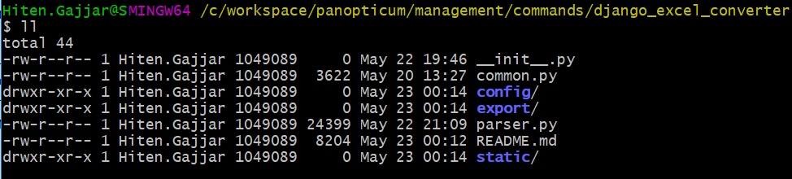
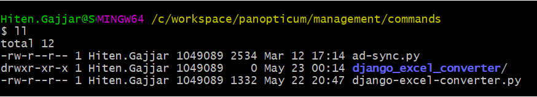
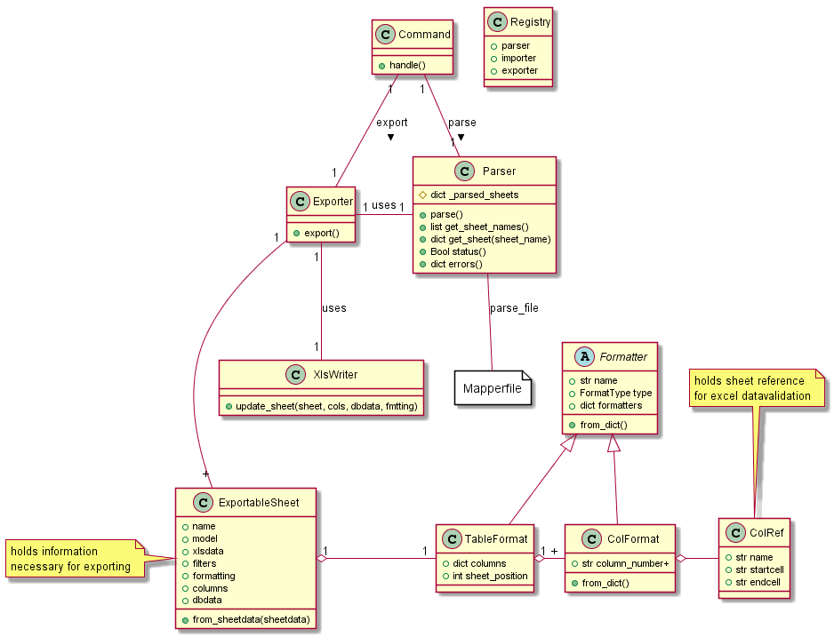

# django-excel-converter
This project aims at providing a configurable way to export/import Django models to/from excel via configuration file. 

It can be used as a [django admin command](https://docs.djangoproject.com/en/3.0/howto/custom-management-commands/) or integrate with your Django application to allow import and export via browser.

## Why yet another Django importer/exporter project
While working with [Panopticum project](https://github.com/perfguru87/panopticum) realized we needed to have excel data in human understandable format for projects with complex and large database schemas. This tool allows user to control columns to export and choose reference table column in case of FKEYs and M2M. This ensures that exported excel is readable and meaningful without unnecessary numeric FKEYs or M2M keys. 
This project aims to provide application aware import and export functionality between Django models and excel. This is extremely useful when

 1. you want your application users to provide information in excel format instead of them logging to application UI.
 2. you have multiple developers and want to create development environment with partial data set. 

## Installation
There are multiple ways to use this project with your Django application. Below listed 2 methods - 

1. Django management command
2. Import / Export from UI

### Django Management command
To use this project as [django admin command](https://docs.djangoproject.com/en/3.0/howto/custom-management-commands/) follow below instructions:

1. Checkout source code inside `<django_project>/management/commands`. So folder structure looks like as shown below
   
2. Create `django-excel-converter.py` under `<django_project>/management/commands` and copy below code in it.
    ```python
    from django.core.management.base import BaseCommand
    from .django_excel_converter.common import Registry
    from .django_excel_converter.parser import Parser
    from .django_excel_converter.export.excel_writter import XlsWriter
    from .django_excel_converter.export.exporter import Exporter
    
    class Command(BaseCommand):
        def add_arguments(self, parser):
            parser.add_argument('-x', '--' + 'xls_file', help='Export XLS file', required=True)
            parser.add_argument('-c', '--' + 'config', help='Config file (preferred absolute path)', required=True)
    
        def handle(self, *args, **options):
            # Registry maintains common instance for parser, exporter, importer etc. Its used for internal processing.
            Registry.parser = Parser(options['config'])  # you need to provide location to configuration file.
            Registry.parser.parse()  # wrap this around try-except to handle any exceptions
            # you can check for errors using parser.errors() and resolve errors in config.YAML
    
            # Now instantiate exporter by providing XlsWriter(path_to_export_xls_file, should_overwrite_yes_no)
            overwrite_yes = True
            Registry.xlwriter = XlsWriter(options['xls_file'], overwrite_yes)
            Registry.exporter = Exporter()
            Registry.exporter.export()  # wrap this around try-except to handle any exceptions
    ```
3. Now your folder structure should look as shown below
    

4. You can run Django command as shown below
   ```bash
   cd <django_project_base_folder>
   python ./manage django-excel-converter -x django_excel_converter_export.xlsx -c config.YAML
   ```

5. You can also consider enable logging. In case of errors, this project dumps valuable processing information.

### Import Export from UI
In this option, django-excel-converter project can be integrated within your Django application with predefined `config` configuration file to import/export from excel file. 

> TODO: provide technical details

## Features
* Control Django models for import/export using configuration file.
* Pick and choose Django models, their attributes.
* Declare fields to export in case of foreign dependency. (existing converters will just consider FKEY)
* Simple excel formatting while exporting to excel. Below formatting is supported - 
  * column wrap length
  * comments at column header level. You can specify - 
    * author
    * height
    * width
  * excel table style
  * Protected sheets (whole sheet, certain columns only)
  * FKEY fields have data validation enabled if related model is exported as well.
  * Many to many fields exported without data validation enabled.

# Technology
1. Python3.6 -- should work with python v3.6 and above. However, its tested with python3.6
2. Djano2.7 -- should work with Django v2.7 and above. However, its tested with django2.7
3. Below python libraries are used
    1. [python-box](https://pypi.org/project/python-box/)
    2. [attrs](https://pypi.org/project/attrs/)
    3. [openpyxl](https://pypi.org/project/openpyxl/) 

## Internals
Application is split into below components with specific role.
1. **`class Parser`** -- responsible to parse configuration config YAML and provide dictionary of exportable sheets, its related dataset and formatting information.
2. **`class Registry`** -- responsible to provide global access to `Parser`, `Exporter`, `Importer` instances. This is used for internal functioning.
3. **`class Exporter`** -- responsible for exporting Django models to the excel file. The dependence models should be exported first and then dependent so that excel sheets have correct data validation. This is achieved using DFS algorithm.
4. **`class Importer`** -- responsible for import excel file into Django model. This class also provides additional functionality like `--dry-run` which can be useful to test excel data against database.
5. **`class XlsWriter`** -- responsible for creating excel file
6. **Excel Formatters** -- These are set of classes assisting Excel Writer and Exporter to format excel. 



There are primarily 2 main inputs to the application -
1. Config YAML file - this is link between Django models and excel workbook (excel file). Please see sample `config\config.yml` file for Panopticum
2. Excel file - (a) exporter case - file will be created, (b) importer case - data will be read from the file.
    1. Each Django model is exported to one or many sheets. Generally 1 model to 1 excel sheet.
    2. FKEY data is controlled via excel data validation
        > TODO: Add GIF explaining this case.
    3. Exported sheets are excel formatted using formatting information if provided in config.YAML

## TODO & Limitations
### TODO
* P1 - Auto tests
* P1 - Importer application
* P1 - For export, consider sheet positions in the order they are defined in config YAML file
* P1 - Generic option to exclude specific fields at time of export. e.g. `id`
* P1 - Dedicated classes for Parsed entities. Have a better usage of these various parsed objects within Importer and Exporter classes. This will enable better programmatic way of using library elements.
* P1 - Externalize M2M & FKEY display formats. The characters used for separating fields needs to be escaped
* P2 - Apply predefined filters like export latest-only, sort
* P2 - Parser errors should point YAML line number
* P2 - Support M2M reverse relationship. e.g. In Panopticum, we would like to export/import [`DatacenterModel`](https://github.com/perfguru87/panopticum/blob/master/panopticum/models.py#L723) within [`ComponentDeploymentModel`](https://github.com/perfguru87/panopticum/blob/master/panopticum/models.py#L680) sheet.
* P2 - Support nested references e.g. ComponentDeploymentModel.version.component.name
* P2 - Version support (atleast provide version say to Django command with `-v` option)
* P2 - Exporter - Validate if all keys from `index_key` are exported
* P3 - In case of export, if a model is exported to multiple excel sheets (possible due to usage of different filters), then any reference into it should be supported. e.g. [`ComponentVersionModel`](https://github.com/perfguru87/panopticum/blob/master/panopticum/models.py#L365) is exported to 2 sheets `compver_latest` having all latest version and `compver_notlatest` having all versions which aren't part of `compver_latest`, while data within sheet [`ComponentDependencyModel`](https://github.com/perfguru87/panopticum/blob/master/panopticum/models.py#L594) wants to provide excel data validation on [`version`](https://github.com/perfguru87/panopticum/blob/master/panopticum/models.py#L602) field which should refer to either `compver_latest` or `compver_notlatest` 
* P3 - Importer - Parser should have option to skip formatting information 
* P4 - Export multiple datasets to same sheet (allow relations)

### Limitations
* M2M display format is hardcoded. Multiple M2M values are placed in same cell with each entry starting with '* ' and ending EOL
* FKEY display format is hardcoded. Multiple attributes if defined are separated with special string ' - '. Parser assumes attribute value won't have '-' character (BAD ASSUMPTION)   